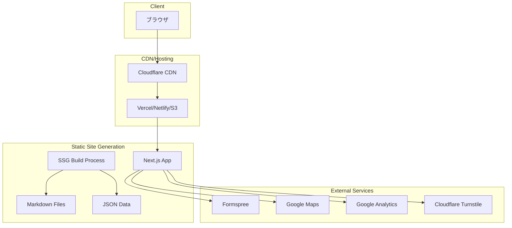
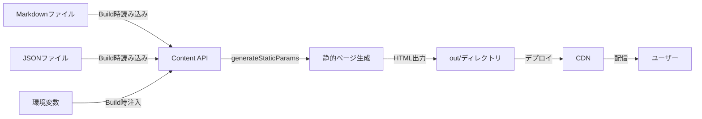
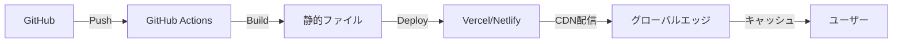
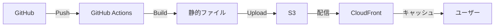

# アーキテクチャ設計書

## 概要

本プロジェクトは、Next.js 14 (App Router) を基盤とした企業向けホームページテンプレートです。静的サイト生成（SSG）を採用し、高速な表示と優れたSEOパフォーマンスを実現しています。

## 技術スタック

### フロントエンド

- **Next.js 14.2.x** - React フレームワーク（App Router）
- **React 18.x** - UIライブラリ
- **TypeScript 5.x** - 型安全な開発
- **Tailwind CSS 3.x** - ユーティリティファーストCSS

### 開発ツール

- **pnpm 8.x** - 高速なパッケージマネージャー
- **ESLint** - コード品質管理
- **Prettier** - コードフォーマッター
- **Vitest** - ユニットテスト
- **Playwright** - E2Eテスト

### 外部サービス

- **Formspree** - フォーム送信サービス
- **Google Maps API** - 地図表示
- **Google Analytics** - アクセス解析
- **Cloudflare Turnstile** - Bot対策

## アーキテクチャ図



## ディレクトリ構造

```
/
├── app/                    # Next.js App Router
│   ├── (site)/            # ルートグループ（レイアウト適用）
│   │   ├── layout.tsx     # 共通レイアウト
│   │   └── [pages]/       # 各ページコンポーネント
│   ├── globals.css        # グローバルスタイル
│   └── layout.tsx         # ルートレイアウト
├── components/            # Reactコンポーネント
│   ├── ui/               # 基本UIコンポーネント
│   ├── sections/         # ページセクション
│   ├── layout/           # レイアウトコンポーネント
│   └── integrations/     # 外部サービス統合
├── content/              # Markdownコンテンツ
├── data/                 # JSONデータ
├── lib/                  # ユーティリティ関数
├── config/               # 設定ファイル
├── types/                # TypeScript型定義
├── hooks/                # カスタムフック
├── styles/               # スタイル関連
├── tokens/               # デザイントークン
├── tests/                # テストファイル
└── public/               # 静的ファイル
```

## データフロー



## 主要コンポーネント

### レイアウトシステム

```typescript
// app/(site)/layout.tsx
- Header（ヘッダー）
- Footer（フッター）
- Breadcrumb（パンくずリスト）
- MobileMenu（モバイルメニュー）
- MegaMenu（デスクトップメガメニュー）
```

### ページコンポーネント

```typescript
// 静的ページ
- HomePage（トップページ）
- HousePage（事業紹介）
- CompanyPage（会社情報）
- ContactPage（お問い合わせ）

// 動的ページ
- WorksPage（施工事例一覧/詳細）
- NewsPage（ニュース一覧/詳細）
- TopicsPage（トピックス一覧/詳細）
```

### UIコンポーネント

```typescript
// Atomic Design風の構成
- Atoms: Button, Badge, Input, etc.
- Molecules: Card, Accordion, Modal, etc.
- Organisms: ContactForm, MediaGallery, etc.
```

## ビルドプロセス

1. **コンテンツ収集**
   - Markdownファイルの解析（gray-matter）
   - frontmatterメタデータの抽出
   - JSONデータの読み込み

2. **静的パス生成**
   - generateStaticParamsで全ページパスを列挙
   - 動的ルートの静的生成

3. **ページレンダリング**
   - Reactコンポーネントのサーバーサイドレンダリング
   - 構造化データの埋め込み
   - メタデータの生成

4. **最適化**
   - HTML/CSS/JSの圧縮
   - 画像の最適化（next/image）
   - フォントのサブセット化

5. **出力**
   - out/ディレクトリへの静的ファイル出力
   - sitemap.xmlの生成
   - robots.txtの生成

## パフォーマンス最適化

### 画像最適化

```typescript
// 画像の遅延読み込みと最適化
- WebP形式への自動変換
- レスポンシブ画像の生成
- Lazy Loading実装
- プレースホルダー表示
```

### コード分割

```typescript
// 動的インポートによるコード分割
- ルートベースの自動分割
- 大きなライブラリの遅延読み込み
- 重要でないコンポーネントの遅延読み込み
```

### キャッシュ戦略

```typescript
// 静的アセットのキャッシュ
- 長期キャッシュヘッダー設定
- フィンガープリント付きファイル名
- Service Workerによるオフライン対応（将来実装）
```

## セキュリティ

### コンテンツセキュリティポリシー（CSP）

```typescript
// セキュリティヘッダーの設定
- Content-Security-Policy
- X-Frame-Options
- X-Content-Type-Options
- Referrer-Policy
```

### フォームセキュリティ

```typescript
// Bot対策とバリデーション
- Cloudflare Turnstile統合
- サーバーサイドバリデーション
- レート制限（Formspree側で実装）
```

## 状態管理

### クライアントサイド状態

```typescript
// Reactの標準機能を使用
- useState（ローカル状態）
- useContext（グローバル状態）
- カスタムフック（ロジックの再利用）
```

### サーバーサイド状態

```typescript
// ビルド時の静的データ
- ファイルシステムベースのコンテンツ管理
- 環境変数による設定管理
```

## テスト戦略

### ユニットテスト

```typescript
// Vitestによるコンポーネントテスト
- UIコンポーネントの動作確認
- ユーティリティ関数のテスト
- カスタムフックのテスト
```

### 統合テスト

```typescript
// Testing Libraryによる統合テスト
- ユーザーインタラクションのシミュレーション
- フォーム送信フローのテスト
- ナビゲーション動作のテスト
```

### E2Eテスト

```typescript
// Playwrightによる実ブラウザテスト
- クリティカルパスのテスト
- クロスブラウザテスト
- レスポンシブデザインのテスト
```

## デプロイメントアーキテクチャ

### 推奨構成



### 代替構成（AWS）



## 拡張性

### プラグインシステム

将来的な拡張ポイント：

1. **コンテンツソース**
   - Headless CMS統合
   - データベース接続
   - API統合

2. **機能拡張**
   - 多言語対応
   - A/Bテスト
   - パーソナライゼーション

3. **パフォーマンス**
   - エッジコンピューティング
   - Incremental Static Regeneration（ISR）
   - On-demand Revalidation

## ベストプラクティス

1. **コンポーネント設計**
   - 単一責任の原則
   - Props契約の明確化
   - 再利用性の重視

2. **型安全性**
   - 厳格なTypeScript設定
   - 型推論の活用
   - 実行時型チェック（zod）

3. **アクセシビリティ**
   - セマンティックHTML
   - ARIA属性の適切な使用
   - キーボードナビゲーション

4. **パフォーマンス**
   - Core Web Vitalsの最適化
   - バンドルサイズの監視
   - 不要な再レンダリングの防止

---

最終更新: 2025-08-14